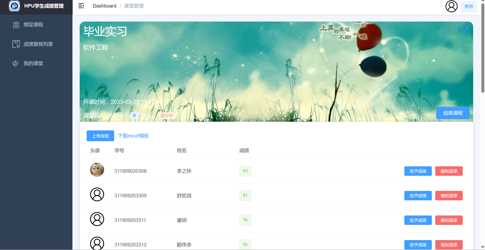

# 基于SpringBoot+Vue+Element-ui的学生成绩管理系统

#### 介绍
基于SpringBoot+Vue+Element-ui的学生成绩管理系统，包含学生成绩查询，分析，复核以及配套的人员，课程管理，选课等基础功能。该系统为本人毕设作品，已开源，可用于大作业，课设，毕设以及学习交流
、

#### 软件架构
后端：SpringBoot+Mysql+Redis+MyBatis-plus
前端：Vue2.X+Element-UI

#### 安装教程

### 后端：
1. 安装redis并启动，若有密码需要在application-dev.yaml中配置
2. 在本地mysql中新建一个名为springboot_student的是空数据库，然后将数据库文件导入
3. 更改application-dev.yaml中的配置
更改数据库用户密码：

更改发送邮件用的网易邮箱以及协议密码

4. 将项目文件中的images文件夹放在E:/uploads下，当然也可以放在其它路径中并在application-dev.yaml中配置
5. 启动后端
### 前端：
安装完vue项目所需环境后npm install后npm run dev即可。npm install时需注意版本冲突问题
#### 项目体验
[项目体验地址](http://8.142.40.213:8081/login)
测试账号与密码（也可自己邮箱注册）：
 1. 管理员：111909010418   123456
 2. 教师:   63513   314833
 3. 学生:   311909020308    267723

#### 参与贡献

1.  Fork 本仓库
2.  新建 Feat_xxx 分支
3.  提交代码
4.  新建 Pull Request

